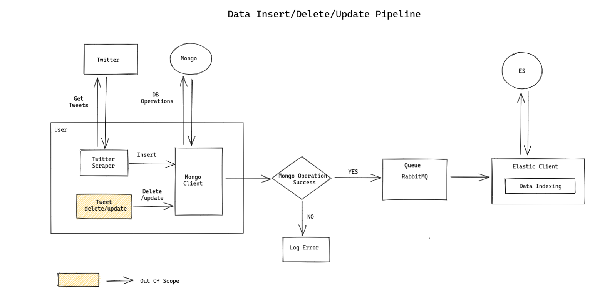
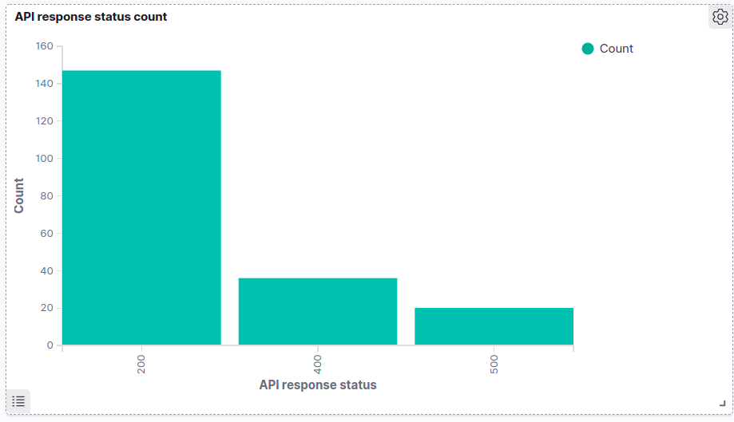
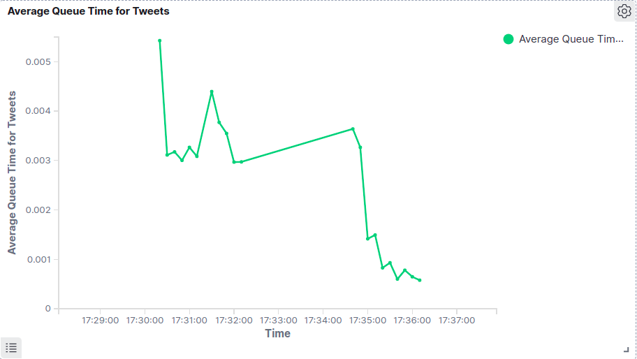

# Tweet Search Engine Prototype


# Problem Statement

Induction Project(TweetSearcher):

* Need to build Tweet Search Engine
* Write small scrapper to scrap tweets
* Setup ES 7.8 and create index 
* Setup Mongo to save raw data of tweets 
* Think about different params on which text search can be provided
* Think about different params on which filters can be given 
* Write indexing script for indexing tweets from Mongo to ES 
* Implement search/filter APIs using Django 
* Implement data aggregation APIs
* Setup Kibana 7.8 for logging and monitoring  
* Setup open source queueing mechanism and log data into Kibana

---
# Stories Planned

1. With sample fields from twitter API payload, write a script to scrape tweets and insert in mongo db.  - `done`

2. Implement Queue consumer and producer classes for integration layer from mongo to ES - `done`

3. With sample fields from queue consumer, implement a layer to add data to ES - `done`
    
4. Revisit the solution to understand search requirements and create architecture, schema and indexing strategy - `done`

5. Make changes in data fetch and insert pipeline according to fields decided for new schema - `done`

6. Explore ES documentation to understand query construction for search, filter, data agg and setups - `done`

6. Define Rest APIs schema for search, filter and data aggregation and corresponding ES queries - `done`

7. Create Django APIs for search, filter and data aggregation - `done`

8. Log info and error messages in ES and create visualizations - `done`

9. Add in code documentation/ comments - `in progress`

----

# TODO Stories

1. Replace Emojis and Emoticons on tweet text and user screen name, description

------
# Data Insert Architecture




------

# Search And Filters to support

* Search 
    1. Get all tweets with hashtags
    2. Get all tweets where a specific user is mentioned
    3. Get all tweets by a user
    4. Get all tweets containig given text

* Filter 
    1. Source - posted through iphone/android/webapp or other
    2. Tweet is a reply to another tweet or is original
    3. Tweet created_at date
    4. Retweet or like counts
    5. user ID creation date - older IDs more chances of a genuine user 

* Sort on 
    1. Retweet 
    2. Likes
    3. Tweet Creation date
    4. user Id creation date
    5. Hits (for text search)


* Aggregations to display (in progress)
    ex - if a user searches with a specific hashtag, 

    show count of tweets on each day for past few days with the hashtag
    Relataed Hashtags count 
        - If a user searches with #indvseng
            - tweets with this hashtag will contain other related hashtag like #kohli, #century, show counts of this

-----------

# Twitter Data Scraping

* API Documentation

```
https://developer.twitter.com/en/docs/twitter-api/v1/tweets/search/api-reference/get-search-tweets
```

* API

```
https://api.twitter.com/1.1/search/tweets.json?q=kohli -RT&count=100&max_id=-1&lang=en&tweet_mode=extended&result_type=recent
```


* Parameters
    * `q = kohli -RT` :  Search for all tweets containing "Kohli" and which are not retweets (original tweets)
    * `count = 100` : Max tweets to extract 100
    * `max_id = -1` : This parameter for the first request is -1. For subsequent requests, next_query parameter from the previous response is used
    * `lang = en` : Only return tweets with language english
    * `tweet_mode = extended` : Do not truncate the tweet text
    * `result_type = recent` : Show recent results, this can also be set to popular


* Fields to Extract (For user specific details, only look for details that are less likely to change)

    * created_at
    * id_str
    * full_text
    * Array of hashtags mentioned in tweet. Each Array contains 
        * text
    * Array of users mentioned in the tweet. Each array contains
        * screen_name
        * user_name
    * Source 
    * parent tweet id : in_reply_to_status_id_str
    * parent user screen name : in_reply_to_screen_name
    * User Info 
        * user name
        * user screen name
        * user location
        * description
        * created_at
    * retweet_count
    * favorite_count


----------

# RabbitMQ Setups


`http://localhost:15672/`


```
sudo systemctl start rabbimq-server
sudo systemctl stop rabbimq-server
```


1. `Message acknowledgment setup` - rabbitmq deletes messages only if the consummer sends ack. If no ack is received and consumer dies, it reques the message and redelivers to other consumer.  That way you can be sure that no message is lost, even if the workers occasionally die.

2. `Durable Queue` - Even if the server/node is restarted, queues are not lost. 

3. `Durable messages` - set delivery mode as 2. Messages are saved in disk hence persistent. For sronger guarentee of message delivrability, check publisher confirms.

4. `Fair Dispatch` - not to give more than one message to a worker at a time. Don't dispatch a new message to a worker until it has processed and acknowledged the previous one. Instead, it will dispatch it to the next worker that is not still busy.

```
channel.basic_qos(prefetch_count=1)
```

---


# API Definition

## Autocomplete API

* `GET` API
    * ?suggestions

* Parameters
    * field - required
    * text - required
    * num_suggesion - optional

* Used on 
    * hashtags

    * user info to get user_name. Search API only need to search with user_name 
        * user_name
        * user_screen_name
        * user_description

    * tweet text suggestion

* Response Structure
    * result
        * array of suggestions with score
    * response
        * status
        * message


## Search API 

* `POST` API 
    * ?search_tweet

* Parameters
    * `hashtag` 

    * `user_mentioned`

    * `by a user`

    * `tweet_text`

    * `tweet_source`

    * `isOriginal`
    
    * `created_at` 
        
    * `sort`

    * `from`

    * `size`

## Aggregation API

* `POST` API
    * ?search_tweet_aggs

* Parameters
    * same as search API used for search

    * extra params used for aggregation
        * `hastag_agg`
            ex - terms

        * `user_mentioned_agg`
            ```
            {
                'terms': {
                    'nested' : 'screen_name'
                }
            }
            ```
            ex - screen_name:terms, ... 

        * `tweet_source_agg`

        * `is_original_agg`

        * `created_at_agg`
            * ex - date_histogram

        * `retweet_count_agg`
            ```
            {
                'min': {}, 
                'max': {}, 
                'histogram' : {
                    'interval' : 20
                }
            }
            ```
            

        * `favorite_count_agg`

    
* Response Structure
    * result
        * array of tweets with score
        * count
        * from 
        * size
    * response
        * status
        * message

---
# ES Query Generation 

* Top level Query is `Filter` and `Must` 

* In Filter, OR query is `Should` and AND query is `Must`/`filter`

* In Must, OR query is `should` and AND query is `must`

---
# Kibana Visualizations (Few examples)

1. Response Status of All API calls in given time range



2. Time spent by tweet data in queue



---

# Docker Image 


Navigate to the source folder. `searchplayground/TweetSearchProject/src`

1. Build new docker image 

```
docker-compose up --build
```


2. Start containers from the existing image

```
docker-compose up
```


3. Scrape the Tweets. Any number of topic can be provided

```
docker-compose run scraper_app python scraper/scraper_main.py 'topic1' 'topic2' 'topic3' 'topic4'
```